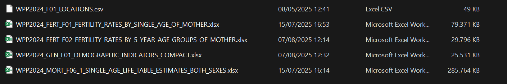

# Development and Fertility

Authors: Thomas Spoorenberg, Hsin Sheng Ma, Henrik-Alexander Schubert

## Purpose
This project seeks to describe the relationship between development and fertility around the globe in the period between 1950 and 2024 around the world using the World Population Prospects 2024.

## Prerequisites
In order to run the files you need to download the data from WPP 2024 and store in the folder ./raw. The [age-specific fertility rates](https://population.un.org/wpp/assets/Excel%20Files/1_Indicator%20(Standard)/EXCEL_FILES/3_Fertility/WPP2024_FERT_F01_FERTILITY_RATES_BY_SINGLE_AGE_OF_MOTHER.xlsx) and 
, the [single-year life tables](https://population.un.org/wpp/assets/Excel%20Files/1_Indicator%20(Standard)/EXCEL_FILES/4_Mortality/WPP2024_MORT_F06_1_SINGLE_AGE_LIFE_TABLE_ESTIMATES_BOTH_SEXES.xlsx) and the [Bundled files](https://population.un.org/wpp/assets/Excel%20Files/1_Indicator%20(Standard)/EXCEL_FILES/1_General/WPP2024_GEN_F01_DEMOGRAPHIC_INDICATORS_COMPACT.xlsx) can be downloaded by following the hyperlinks.

# Folder structure

## ./code: 

- [Data preperation](code/01_data_preperation.R): The data is loaded, cleaned and stored.
- [Descriptivie statistics](code/02_descriptives.R): The raw data is described.
- [Breakpoint analysis](code/03_clustering.R): Country pattern are described using segmented linear regression.
- [Sequence analysis](code/04_sequence_analysis.R): Countries are clustered using sequence analysis.
- [Parametric shape](code/05_parametric_shape.R): The parametric shape is captured with polynomial regression models.

- code/functions.R: Helper functions
- code/graphics.R: Sets the graphic style

## ./raw: 

This folder contains the raw, unedited data from WPP2024.

- Fertility: [age-specific fertility rates](https://population.un.org/wpp/assets/Excel%20Files/1_Indicator%20(Standard)/EXCEL_FILES/3_Fertility/WPP2024_FERT_F01_FERTILITY_RATES_BY_SINGLE_AGE_OF_MOTHER.xlsx)
- Mortality: [single-year life tables](https://population.un.org/wpp/assets/Excel%20Files/1_Indicator%20(Standard)/EXCEL_FILES/4_Mortality/WPP2024_MORT_F06_1_SINGLE_AGE_LIFE_TABLE_ESTIMATES_BOTH_SEXES.xlsx)
- Locations: UN location names
- WPP 2024 Summary: [Bundled files](https://population.un.org/wpp/assets/Excel%20Files/1_Indicator%20(Standard)/EXCEL_FILES/1_General/WPP2024_GEN_F01_DEMOGRAPHIC_INDICATORS_COMPACT.xlsx)

## ./data:

This folder is used for storing the manipulated data created with the ./code files from the raw data under (./raw).

## ./tables:
This folder contains the tables.

## ./figures:
This folder contains the figures.
